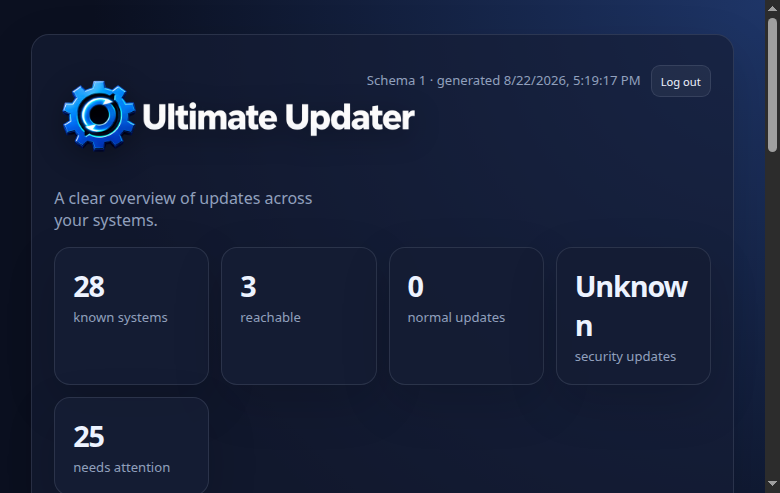

# Ultimate Updater 5.1

Central, safety-conscious updates and checks for Proxmox hosts, LXC
containers, VMs, and selected external systems.

Proxmox® is a registered trademark of Proxmox Server Solutions GmbH.

Ultimate Updater is an independent project and is not an official program
from Proxmox Server Solutions GmbH.

> This software is distributed in the hope that it will be useful, but
> **WITHOUT ANY WARRANTY**. See the [GNU General Public License](LICENSE) for
> more details. You are responsible for validating the configuration and
> maintaining suitable backups before using it on important systems.

**IN CASE OF EMERGENCY, I HOPE YOU HAVE BACKUPS FROM YOUR MACHINES!**

**YOU HAVE BEEN WARNED!**

## What it does

Ultimate Updater is installed once on a Proxmox cluster and gives you one
place to check and update hosts, LXC containers, VMs, and configured external
systems. It supports interactive and headless operation, persistent jobs,
status reporting, notifications, snapshots/backups, filters, and a central
Web UI.

Key features include:

- A central cluster-aware CLI and Web UI.
- Read-only checks separated from mutating updates.
- APT, DNF/YUM, Pacman, APK, Windows, and FreeBSD/pfSense paths according to
  the current support matrix.
- VM access through QEMU Guest Agent or SSH, with lifecycle restoration.
- Persistent server-side jobs that continue after a browser or SSH session
  disconnects.
- Separate normal/security counts where classification is supported; other
  systems show a total count.
- Snapshot and backup safety controls, filters, notifications, and logs.

## Getting started

Start with these three guides:

1. [Install Ultimate Updater](docs/installation.md)
2. Review [configuration and safety settings](docs/configuration.md).
3. Learn the difference between [checks and updates](docs/checks-and-updates.md).

Then use the [Web UI](docs/web-ui.md) to review the inventory and run a check
before deliberately starting an update.

## Web UI

The authenticated Web UI is served by `ultimate-updater-web.service` on port
8765, preferably over HTTPS. It provides the dashboard, target details,
checks, updates, settings, Internal SSH management, persistent jobs/logs, and
version/build information. See [Web UI](docs/web-ui.md).

> Current 5.1 dashboard from a dedicated test environment.

## Supported systems

Proxmox hosts and Linux LXC/VM guests are the primary supported paths. APT
systems provide a normal/security split. `pkg` (FreeBSD/pfSense), Pacman,
APK, DNF/YUM, and Windows use total-only update presentation where a reliable
security split is not available. Windows remains experimental/deferred from
the supported 5.1 baseline pending dedicated validation.

External Linux systems can be configured over SSH. Read the complete matrix
and limitations in [Supported systems](docs/supported-systems.md) and
[External systems](docs/external-systems.md).

## Safety essentials

- Check and Update are separate operations. A check is read-only as far as
  technically possible and never reboots a VM.
- A check may temporarily start or resume a stopped/paused guest when enabled,
  then restores its original lifecycle state, including after errors.
- `REBOOT_IF_NEEDED` applies to the update path only.
- Snapshot and backup are independent controls. An invalid or inactive backup
  storage is rejected rather than silently ignored.
- Jobs run server-side and retain their status/log after the client disconnects.
- Do not expose the action-enabled Web UI to an untrusted network.

## Documentation

- [Installation](docs/installation.md)
- [Configuration](docs/configuration.md)
- [Checks and updates](docs/checks-and-updates.md)
- [Cluster operation](docs/cluster.md)
- [Web UI](docs/web-ui.md)
- [SSH and VM access](docs/ssh.md)
- [External systems](docs/external-systems.md)
- [Backup and snapshots](docs/backup-and-snapshots.md)
- [Notifications](docs/notifications.md)
- [Supported systems](docs/supported-systems.md)
- [Troubleshooting](docs/troubleshooting.md)
- [Upgrading](docs/upgrading.md)
- [Advanced operation](docs/advanced.md)

Additional project documents: [Testing](TESTING.md), [5.1 release notes](RELEASE_NOTES_5.1.md), [5.1 upgrade notes](UPGRADE_NOTES_5.1.md), [security policy](SECURITY.md), and [code of conduct](CODE_OF_CONDUCT.md).

## Q&A

[Discussion](https://github.com/BassT23/Proxmox/discussions/60)

## Support

Report reproducible bugs through [GitHub Issues](https://github.com/BassT23/Proxmox/issues) or join the [Discord](https://discord.gg/nVpUg6BKn8). Keep secrets, private keys, and production credentials out of reports.

## Contributors

<table>
  <tbody>
    <tr>
      <td align="center" valign="top" width="14.28%"><a href="https://github.com/BassT23"> <b>BassT23</b></a> <a href="https://github.com/BassT23/Proxmox/commits?author=BassT23" title="Code">💻</a> <a href="#maintenance-BassT23" title="Maintenance">🚧</a></td>
      <td align="center" valign="top" width="14.28%"><a href="https://github.com/Gauvino"> <b>Gauvino</b></a> <a href="https://github.com/BassT23/Proxmox/commits?author=Gauvino" title="Code">💻</a> <a href="#translation-Gauvino" title="Documentation">📖</a></td>
      <td align="center" valign="top" width="14.28%"><a href="https://github.com/elbim"> <b>elbim</b></a> <a href="https://github.com/BassT23/Proxmox/commits?author=elbim" title="Code">💻</a> <a href="#translation-elbim" title="Documentation">📖</a></td>
    </tr>
  </tbody>
</table>

Ultimate Updater is free software under the GNU General Public License. See
the [LICENSE](LICENSE) and [SECURITY.md](SECURITY.md) for project policies.

**AI-assisted development:** OpenAI ChatGPT & Codex are used for code review,
debugging, test planning, documentation, and release preparation. Changes are
reviewed and validated before inclusion in a release.

