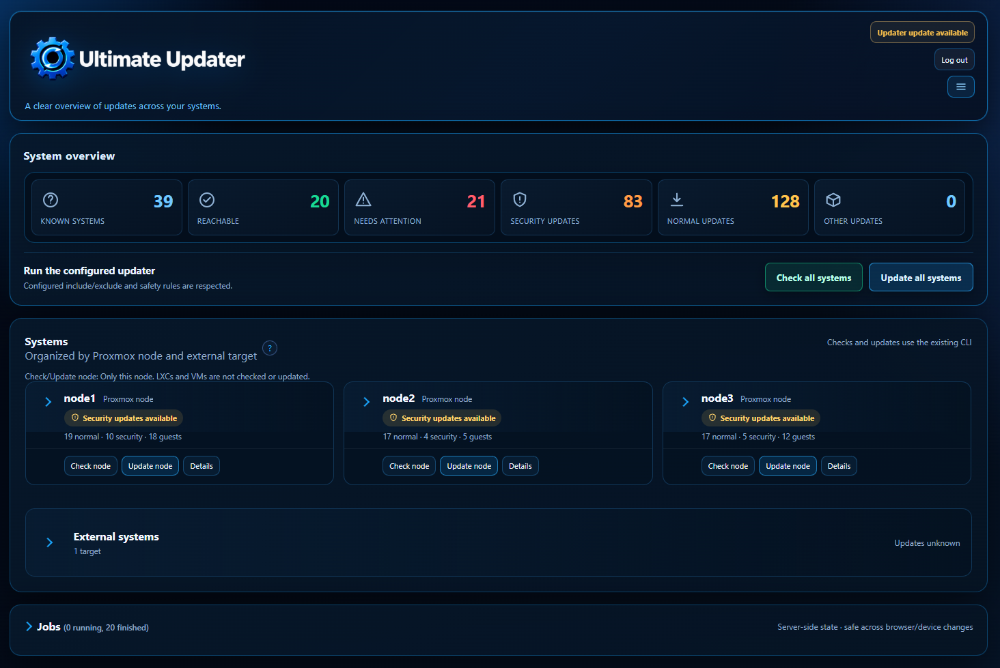
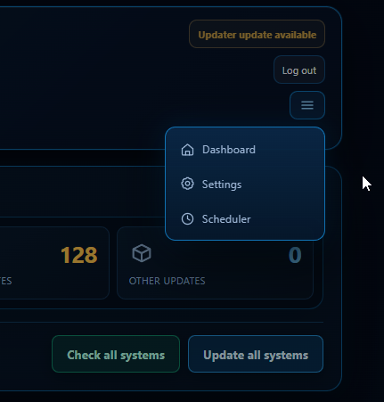
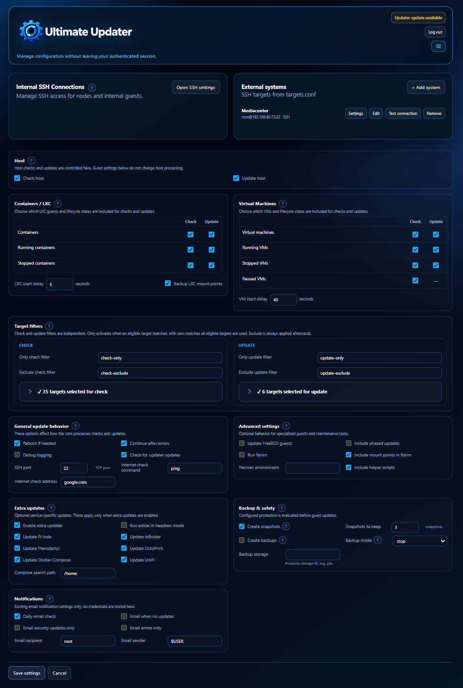
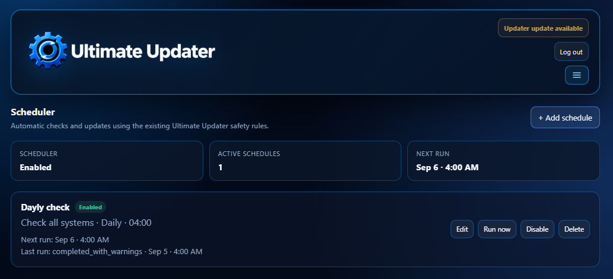
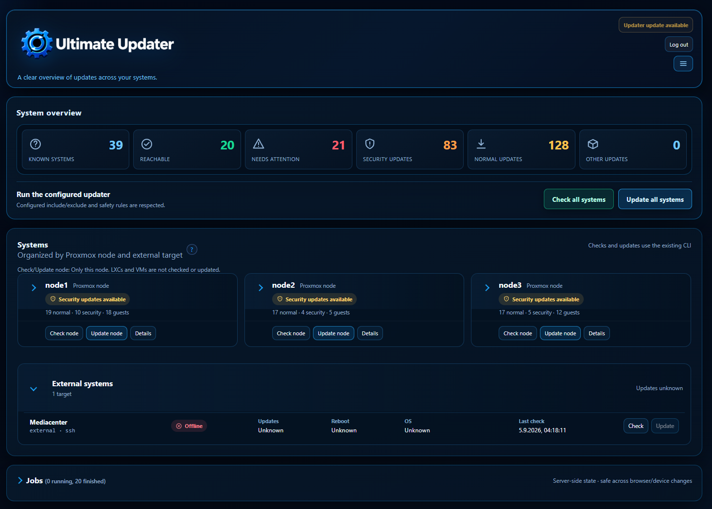

# Web UI

[← Back to README](../README.md)

The Web UI is served by `ultimate-updater-web.service` and listens on port
`8765` by default:

```text
https://<proxmox-node>:8765/
```

It uses the Proxmox-managed certificate when available, accepts TLS 1.2 or
newer, and can use an explicitly configured certificate pair. If automatic
HTTPS has no usable certificate, the documented transition fallback is HTTP;
set `WEB_UI_HTTPS=true` when HTTPS must be required. Use the trusted
management network; this is an action-enabled administrator interface.

## Main areas

- **Dashboard:** nodes, LXC/VM guests, external targets, reachability, update
  state, reboot indicators, and warnings.
- **Target details:** OS, transport, normal/security or total-only update
  information, last check, and errors.
- **Jobs and logs:** persistent server-side job state and retained output.
- **Settings:** typed controls for checks, filters, lifecycle, snapshots,
  backups, notifications, and DEBUG.
- **Internal SSH Connections:** resolved sources and explicit overrides for
  nodes and VMs.
- **Version information:** installed version, branch, commit, exact tag when
  available, and available version.

### Dashboard

The dashboard combines the system overview, node and guest status, external
targets, and server-side jobs in one view.



### Navigation

Use the compact menu button in the header to open the current navigation. It
contains the three available areas: Dashboard, Settings, and Scheduler.



### Settings

Settings are grouped into connection management, target selection, update
behavior, backup and safety, extra updates, and notifications.



### Jobs and logs

Jobs run server-side and remain available after the browser session ends. The
Jobs view shows the action, target, start time, result, exit code, and a link
to the retained log.


### Scheduler

The Scheduler uses the existing job runner and safety rules. It supports
enabled schedules, selected weekdays, next and last run information, and the
actions Edit, Run now, Disable, and Delete.



The UI does not expose a general shell, arbitrary commands, private keys, or
password storage. Configuration writes preserve unrelated settings and are
validated atomically. Updates require browser confirmation.

## Authentication and service control

Normal Proxmox installations authenticate the local administrator through PAM.
The service is root-owned because the existing CLI and job runner need local
permissions. Useful service commands are:

```bash
systemctl status ultimate-updater-web
systemctl restart ultimate-updater-web
journalctl -u ultimate-updater-web
```

The interface is responsive on narrow displays. The dashboard can also show
an expanded external-system section when target details are needed.



The optional login welcome screen is separate from the Web UI. It can show
cached update information at login and uses the local check configuration;
the cache is refreshed by the regular update check. It does not wait for a
live GitHub version request during login.

Related: [Configuration](configuration.md), [SSH and VM access](ssh.md),
[Troubleshooting](troubleshooting.md).
